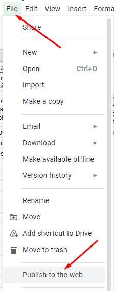
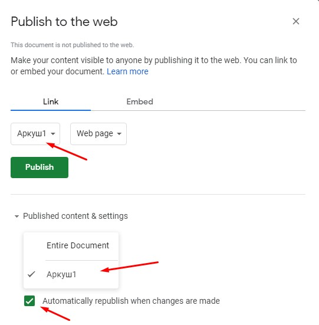
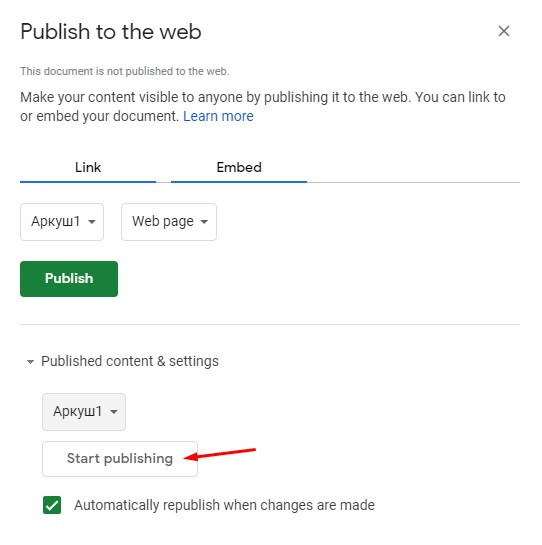
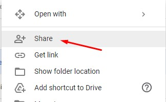
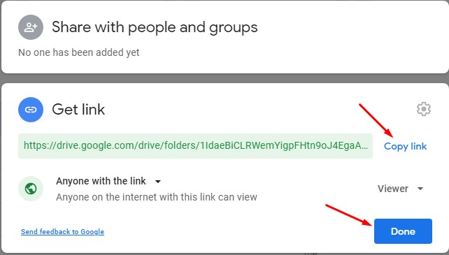
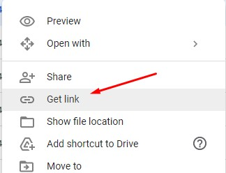
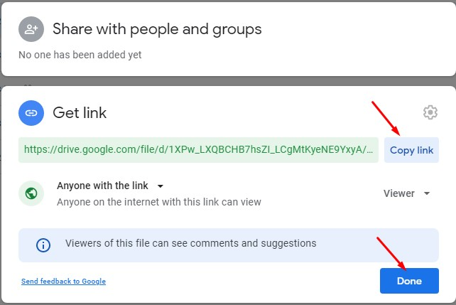
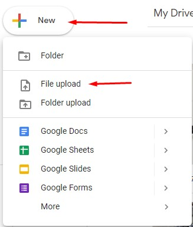

# UA

## Простенький додаток-вітрина

### Запуск

Цей додаток написаний з використанням чистих html/css

Все, що потрібно для запуску додатку - відкрити його за допомогою live server

### Налаштування 

Всі значущі налаштування знаходяться у файлі `js\config.js`.

Налаштування:
- `sheetId` - id файла гугл таблиць, в якому зберігаються дані з контентом карочок
- `imgColName` - назва колонки в файлі гугл  таблиць з посиланням на зображення
- `titleColName` - назва колонки в файлі гугл  таблиць з назвою товару
- `descColName` - назва колонки в файлі гугл  таблиць з описом товару
- `priceColName` - назва колонки в файлі гугл  таблиць з актуальною ціною товару
- `priceBeforeDiscountColName` - назва колонки в файлі гугл  таблиць з ціною товару до знижки, якщо така надається

### Налаштування гугл таблиці

- Створіть новий файл в гугл таблицях;
- В першому рядку задайте імена контентних колонок;
- Задайте контент карточок починаючи із 2-го рядку;
- Задайте відповідні назви колонок у файлі додатку `js\config.js`;
- Опублікуйте файл гугл таблиць як веб сторінку:
  - написніть `Файл > Опублікувати в інтернеті`

  
  - Оберіть аркуш файлу, який потрібно опублікувати

  
  - натисніть кнопку 'Опублікувати'

  

### Налаштування Гугл Диску

- Зайдіть на гугл диск
- Створіть нову папку
- Зробіть папку доступною за посиланням

  
  
- Додайте зображення до папки
- Скопіюйте посилання на зображення та додайте його до гугл таблиці

  
  

### Редагування контенту сайту

#### Редагування тексту

- Відкрийте файл гугл таблиці з контентом сайту
- Знайдіть потрібний товар
- Замініть текст, яки потрібно відредагувати
- Якщо товару новий - додайте його в новому рядку
- Щоб видалити товар із сайту - видаліть рядок з цим товаром з документу

#### Редагування зображення товару

- Відкрийте папку на гугл диску, де зберігаються зображення з сайту
- Завантажте картинки до папки

  
- Скопіюйте посилання на потрібне зображення

  
  
- Відкрийте файл гугл таблиці з контентом сайту
- Знайдіть потрібний товар
- Додайте або замініти посилання на нове зображення в гугл таблиці

# EN

## Simple shop window app

### Start

It is a vanilla html/css application.

All you need to start application is to run it with live server

### Configuration

All vital configurations are stored in the file `js\config.js`.

Configuration options:
- `sheetId` - google spreadsheet id with all site cards content
- `imgColName` - google spreadsheet column name with card image url
- `titleColName` - google spreadsheet column name with card name text
- `descColName` - google spreadsheet column name with card description text
- `priceColName` - google spreadsheet column name with card active price
- `priceBeforeDiscountColName` - google spreadsheet column name with card price before discount, if any

### Google spreadsheet setup

- Create new clean google spreadsheet;
- In row 1 add content column names;
- Add cards data in rows below;
- Set proper column names to the config file `js\config.js`;
- Publish spreadsheet as web page:
  - press `File > Publish to the web`

  
  - select spreadsheet page to be published

  
  - press 'Start publish' button

  

### Google drive setup

- visit google drive
- create a new folder
- make folder visible by link

  
  
- add images to the folder
- copy image link and save it to the spreadsheet

  
  

### Site content editing

#### Texts editing

- Open google spreadsheet with site content
- Find required product
- Update texts that should be edited
- For a new product add textx is a new line
- To remove product - remove correspondent line from the spreadsheet

#### Product image editing

- Open folder in google drive where product images are being stored
- Upload new images to the folder

  
- Copy link to the required image

  
  
- Open google spreadsheet with site content
- Find required product
- Add or replace image URL to a new image
